<a href="https://silvioalbertoscarfo91.github.io/resume/">
  <picture>
    <source media="(prefers-color-scheme: dark)" srcset="assets/header-dark.svg">
    
  </picture>
</a>

<br>

I'm a Senior Full-Stack Engineer and **Lead Engineer at [ti8m](https://ti8m.com)** in Bern. For seven years I've been building
the digital customs of Switzerland. I work on **DaziT**, the programme of the Federal Office for Customs and Border Security (BAZG):
first the award-winning QuickZoll and Via apps, now **Raporta**, which I lead.

I design the architecture, still write the code, and treat AI agents like any other teammate: clear specs, hard rules,
and every change reviewed.

<br>

### `01` Now

| Project | What I do |
| :------ | :-------- |
| **Raporta** · BAZG / DaziT | Lead Engineer: architecture, a team of 3–4 developers, the link between business and engineering |
| **Abacus timesheet AI** · ti8m | Reads hours from customer PDF timesheets with AI and books them into Abacus automatically |
| **Agentic delivery** · ti8m AI | Spec-driven development with Claude Code: requirements → task plans → agents with a verifiable definition of done |

### `02` Track record

- Moved the team's whole portfolio (QuickZoll, Via, Activ, Periodic, Via-Shop, Raporta) from **Cloud Foundry to AWS**
- Led development and release of **QuickZoll & Via**: *Best of Swiss Apps 2019*
- Built an **Angular PWA** for issuing digital fines and receipts
- Set up layered testing for DaziT services: JUnit, Mockito, **Pact** contract tests, system integration tests

### `03` Lab

| Project | What it is | Stack |
| :------ | :--------- | :---- |
| [**linkedin-post-bot-local**](https://github.com/silvioalbertoscarfo91/linkedin-post-bot-local) | Telegram bot that researches a topic, drafts posts with a local LLM and generates the image with FLUX on Apple Silicon. Nothing leaves the machine. | Python · Ollama · mflux |
| [**linkedin-post-bot**](https://github.com/silvioalbertoscarfo91/linkedin-post-bot) | The cloud edition: the same Telegram flow on NVIDIA-hosted models, publishing through LinkedIn OAuth | Python · OpenAI SDK · NVIDIA API |
| **concurrent-bank** *(private)* | A learning platform for concurrency and distributed systems, built level by level. Rule one: no negative balance, ever. | Java 21 · Spring Boot · Testcontainers |
| [**boilerPlateApp**](https://github.com/silvioalbertoscarfo91/boilerPlateApp) | My React Native starting point: navigation, state and tests ready to go | React Native · Redux · Jest |
| [**resume**](https://github.com/silvioalbertoscarfo91/resume) | My CV as a single hand-written HTML page, which also prints to the PDF | HTML · CSS · JS |

### `04` Toolbox

```text
frontend   Angular · React · React Native · TypeScript · PWA · RxJS · NgRx
backend    Java 21+ · Spring Boot · Apache Kafka · PostgreSQL · Flyway · REST/OpenAPI
cloud      AWS (ECS, RDS, S3, CloudWatch) · Docker · Kubernetes · Jenkins · GitHub Actions
quality    JUnit 5 · Mockito · Pact · Testcontainers · system integration tests
ai         Claude Code · agentic, spec-driven delivery · Ollama · LLM APIs · Python
```

### `05` Contact

**[CV](https://silvioalbertoscarfo91.github.io/resume/)** · **[LinkedIn](https://www.linkedin.com/in/silvio-alberto-scarf%C3%B2-999717175)** · **[silvioalbertoscarfo@gmail.com](mailto:silvioalbertoscarfo@gmail.com)**
<br>
<sub>Wabern, Bern · Italian · Spanish · English · German</sub>
